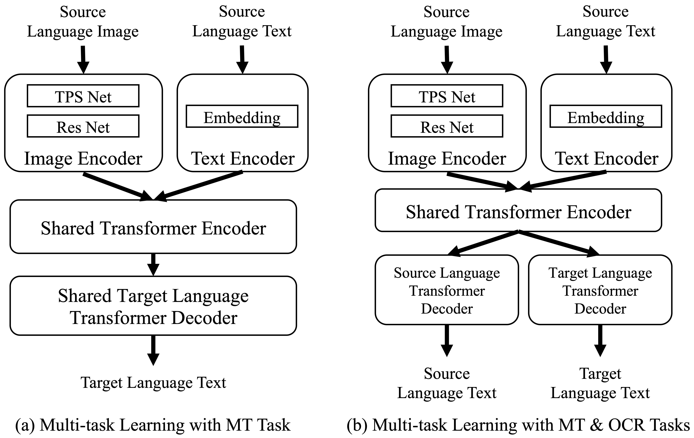

# E2E_TIT_With_MT


E2E_TIT_With_MT: End-to-end Text Image Translation with Machine Translation.

The official repository for ICPR 2022 main conference paper: Improving End-to-End Text Image Translation From the Auxiliary Text Translation Task.


## 1. Introduction

End-to-end text image translation (TIT), which aims at translating the source language embedded in images to the target language, has attracted intensive attention in recent research. However, data sparsity limits the performance of end- to-end text image translation. Multi-task learning is a nontrivial way to alleviate this problem via exploring knowledge from complementary related tasks. In this paper, we propose a novel text translation enhanced text image translation, which trains the end-to-end model with text translation as an auxiliary task. By sharing model parameters and multi-task training, our model is able to take full advantage of easily-available large-scale text parallel corpus. Extensive experimental results show our proposed method outperforms existing end-to-end methods, and the joint multi-task learning with both text translation and recognition tasks achieves better results, proving MT and OCR auxiliary tasks are complementary.





## 2. Usage

### 2.1 Requirements

- python==3.6.2
- pytorch == 1.3.1
- torchvision==0.4.2
- numpy==1.19.1
- lmdb==0.99
- PIL==7.2.0
- jieba==0.42.1
- nltk==3.5
- six==1.15.0
- natsort==7.0.1


### 2.2 Train the Model

```shell
bash ./train_model_guide.sh
```


### 2.3 Evaluate the Model

```shell
bash ./test_model_guide.sh
```


### 2.4 Datasets

We have conducted synthetic, subtitle and street-view datasets. If you want to utilize these datasets for research, please contact with [cong.ma@nlpr.ia.ac.cn](mailto:cong.ma@nlpr.ia.ac.cn).


## 3. Acknowledgement

The reference code of the provided methods are:

- [clovaai](https://github.com/clovaai)/**[deep-text-recognition-benchmark](https://github.com/clovaai/deep-text-recognition-benchmark)**
- [OpenNMT](https://github.com/OpenNMT)/**[OpenNMT-py](https://github.com/OpenNMT/OpenNMT-py)**
- [THUNLP-MT](https://github.com/THUNLP-MT)/**[THUMT](https://github.com/THUNLP-MT/THUMT)**


We thanks for all these researchers who have made their codes publicly available.


## 4. Citation

If you want to cite our paper, please use this bibtex version:

```latex
% To be updated.
```

If you have any issues, please contact with [cong.ma@nlpr.ia.ac.cn](mailto:cong.ma@nlpr.ia.ac.cn).
